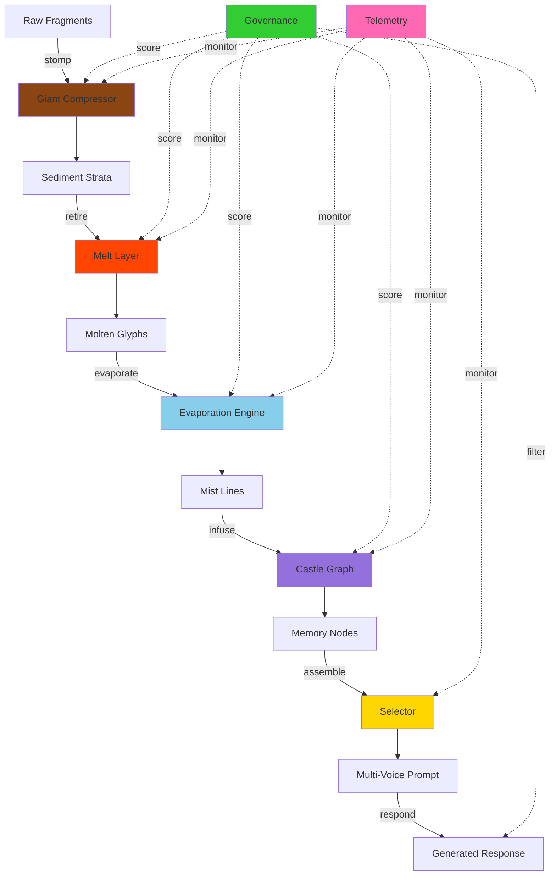
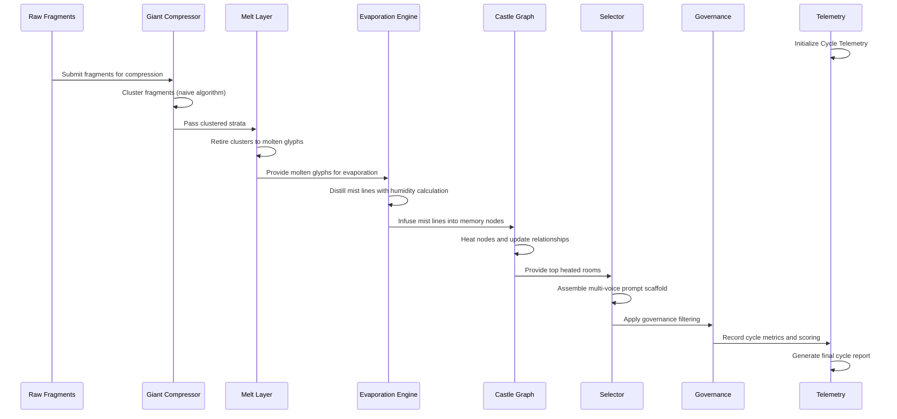

# Cognitive Geo-Thermal Lore Engine

## High-Level Narrative

The Cognitive Geo-Thermal Lore Engine transforms knowledge processing into a living geological system. Like the Earth's layers that compress sediment into stone, melt it into magma, evaporate it into clouds, and crystallize it into new formations, this engine processes raw information through analogous phases.

The system embodies the principle that knowledge, like matter, undergoes state changes that preserve essential properties while enabling new emergent behaviors. Each phase represents a fundamental transformation in how information is structured, accessed, and utilized.

## Technical Architecture

### System Flow Diagram

### Component Interaction Flow

## Glossary: Myth → Component Mapping

### Core Entities

| **Mythic Term** | **Technical Component** | **Function** | **Data Structure** |
|-----------------|-------------------------|--------------|-------------------|
| **Raw Fragments** | Input knowledge pieces | Unprocessed information units | `List[Dict[str, Any]]` with id/text |
| **Giant** | GiantCompressor | Clusters fragments into strata | Class with stomp() method |
| **Sediment Strata** | Clustered data layers | Grouped fragments by similarity | Hierarchical cluster structure |
| **Molten Glyphs** | Processed knowledge units | Retired clusters with provenance | Immutable dict with metadata |
| **Mist Lines** | Proto-thoughts | Evaporated knowledge ready for use | Ephemeral thought fragments |
| **Warbler Cloud** | Mist collection | Atmospheric knowledge state | Cloud storage with humidity index |
| **Memory Castle** | Knowledge graph | Conceptual relationship network | Nodes with heat-based activation |
| **Castle Rooms** | Concept nodes | Individual knowledge chambers | Heated memory locations |

### Process Transformations

| **Mythic Process** | **Technical Operation** | **Input → Output** | **Key Algorithm** |
|-------------------|------------------------|-------------------|------------------|
| **Stomping** | Fragment clustering | Raw fragments → Strata | Naive single-cluster (TODO: semantic) |
| **Melting** | Cluster retirement | Strata → Molten glyphs | Append-only glyph creation |
| **Evaporation** | Mist distillation | Glyphs → Mist lines | Proto-thought generation |
| **Infusion** | Heat distribution | Mist → Castle nodes | Concept extraction + heat boost |
| **Assembly** | Prompt construction | Rooms → Multi-voice scaffold | Top-k room selection |
| **Governance** | Quality assurance | Cycle → Quality score | Drift detection + scoring |

### Control Systems

| **Mythic Guardian** | **Technical System** | **Responsibility** | **Intervention Points** |
|--------------------|---------------------|-------------------|------------------------|
| **Governance Council** | Governance class | Quality & drift monitoring | All phase transitions |
| **Chronicle Keeper** | Telemetry system | Metrics & audit trail | Performance tracking |
| **Heat Sentinels** | Castle graph heat | Memory activation control | Node temperature management |
| **Provenance Scribes** | Hash tracking | Data integrity & lineage | Glyph creation + verification |

## Architectural Principles

### 1. **Geological Metaphor Consistency**
All components follow natural process analogies:
- Compression before melting
- Evaporation before condensation
- Heat distribution in memory networks
- Sedimentary layering for historical preservation

### 2. **Append-Only Integrity**
- Molten glyphs never mutate in-place
- Provenance hashes track all transformations
- Audit trails preserved through telemetry
- Data corruption prevented by design

### 3. **Emergent Complexity**
- Simple rules create complex behaviors
- Heat-based memory activation
- Multi-voice prompt emergence
- Quality assessment through pattern recognition

### 4. **Extensibility Through Placeholders**
- TODO sections mark enhancement points
- Lambda functions ready for ML integration
- Schema versioning enables evolution
- Modular design supports component replacement

## Implementation Status

### ✅ Completed (Scaffold Phase)
- Complete schema definitions (4 JSON files)
- Full engine implementation (7 Python modules)
- Demonstration cycle runner
- Comprehensive telemetry framework
- Quality governance foundation
- Type-safe dataclass structures

### 🚧 Ready for Enhancement (Boss Fight Phases)
- **Semantic Clustering**: Replace naive with ML-based similarity
- **LLM Integration**: Real language generation for mist distillation
- **Persistent Storage**: Database backends for production deployment
- **Advanced Governance**: ML-driven quality and drift detection
- **Multi-Voice Modeling**: Personality-based prompt engineering
- **Performance Optimization**: Caching and parallel processing

### 🔮 Future Visions (Deep Time)
- **Cross-Castle Networks**: Multi-system knowledge sharing
- **Temporal Heat Dynamics**: Historical pattern learning
- **Adaptive Evaporation**: Context-sensitive mist generation
- **Emergent Voice Evolution**: Self-modifying prompt personalities
- **Geological Time Scales**: Long-term knowledge sediment analysis

## Integration Guidelines

### For Developers
1. **Extend, Don't Replace**: Use TODO sections for enhancements
2. **Preserve Metaphors**: Maintain geological naming conventions
3. **Append-Only Safety**: Never mutate existing data structures
4. **Test All Phases**: Validate complete cycle after changes

### For System Architects
1. **Schema Evolution**: Version all data structure changes
2. **Performance Monitoring**: Leverage telemetry for optimization
3. **Quality Gates**: Use governance scoring for production deployment
4. **Scaling Patterns**: Plan for multi-castle deployments

### For Knowledge Engineers
1. **Heat Dynamics**: Understand memory activation patterns
2. **Mist Quality**: Monitor evaporation effectiveness
3. **Voice Coherence**: Ensure multi-voice prompt consistency
4. **Drift Prevention**: Watch for knowledge degradation signals

---

*The Warbler Cloud Genesis marks the beginning of a new era in knowledge processing - where ancient geological wisdom meets cutting-edge cognitive architecture.*