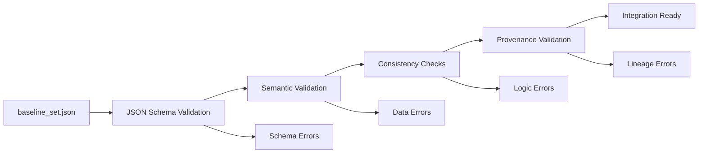

# 🧪 Alchemist Baseline Set Schema Documentation

## Overview

The `baseline_set.json` schema defines the structure for baseline configurations used in Alchemist experiments. This schema ensures consistency, validation, and proper integration with the experimental pipeline from narrative incubation through empirical validation.

## Purpose and Integration

### Alchemist Faculty Integration

The baseline_set system integrates with the [Alchemist Faculty](faculty_alchemist.md) pipeline:

1. **Narrative Incubation**: Gu Pot issues identify the need for baseline establishment
2. **Distillation Trigger**: Baseline sets provide reference metrics for experiment evaluation
3. **Experiment Execution**: Baseline comparisons validate experimental outcomes
4. **Validation/Promotion**: Claims are promoted based on baseline delta analysis
5. **Report Synthesis**: Baseline context enriches experimental reports

### Schema Validation Pipeline



## Schema Structure

### Core Sections

| Section | Required | Purpose |
|---------|----------|---------|
| `metadata` | ✅ | Version, identification, and authorship information |
| `baseline_metrics` | ✅ | Primary, secondary, and derived metrics definitions |
| `experiment_context` | ✅ | Experimental conditions and validation rules |
| `provenance` | ❌ | Experimental lineage and origin tracking |
| `usage_notes` | ❌ | Documentation and migration guidance |

### Metadata Section

```json
{
  "metadata": {
    "version": "1.0.0",                    // Semantic version (required)
    "created_at": "2025-01-15T10:30:00Z",  // ISO 8601 timestamp (required)
    "updated_at": "2025-01-15T10:30:00Z",  // ISO 8601 timestamp (optional)
    "baseline_id": "cognitive_baseline_v1", // Unique identifier (required)
    "description": "Baseline description",  // Human-readable purpose (required)
    "author": "Bootstrap Sentinel",         // Creator name (optional)
    "tags": ["cognitive", "intervention"],  // Classification tags (optional)
    "alchemist_version": "0.1.0"           // Alchemist version (optional)
  }
}
```

**Validation Rules:**
- `version`: Must follow semantic versioning (x.y.z)
- `baseline_id`: Alphanumeric with hyphens/underscores, max 64 chars
- Timestamps: Must be valid ISO 8601 format
- `updated_at` must be >= `created_at` if both present

### Baseline Metrics Section

```json
{
  "baseline_metrics": {
    "primary_metrics": {
      "metric_name": {
        "value": 0.72,                    // Baseline value (required)
        "unit": "ratio",                  // Unit of measurement (required)
        "threshold_upper": 0.85,          // Upper regression threshold (optional)
        "threshold_lower": 0.60,          // Lower regression threshold (optional)
        "tolerance": 0.05,                // Acceptable variance (optional)
        "confidence_interval": {          // Statistical confidence (optional)
          "lower": 0.68,
          "upper": 0.76,
          "confidence_level": 0.95
        },
        "sample_size": 1000,              // Sample size for baseline (optional)
        "statistical_method": "mean"      // Method used (optional)
      }
    },
    "secondary_metrics": { /* Same structure as primary */ },
    "derived_metrics": {
      "derived_name": {
        "formula": "primary_metric * secondary_metric", // Computation formula (required)
        "unit": "composite_score",                      // Result unit (required)
        "description": "Combined effectiveness metric"  // Purpose (optional)
      }
    }
  }
}
```

**Validation Rules:**
- Metric names: Must match `^[a-zA-Z_][a-zA-Z0-9_]*$`
- Thresholds: `threshold_upper` > `threshold_lower` (if both present)
- Confidence intervals: `upper` > `lower`
- Derived formulas: Should reference existing metrics (warning if not found)

### Experiment Context Section

```json
{
  "experiment_context": {
    "experiment_type": "cognitive_performance",    // Type enum (required)
    "applicable_conditions": [                     // Experimental conditions (optional)
      {
        "condition_name": "intervention_type",     // Condition identifier (required)
        "condition_values": ["soft", "hard"],      // Allowed values (optional)
        "default_value": "soft"                    // Default selection (optional)
      }
    ],
    "environment_requirements": {                  // Environment constraints (optional)
      "min_corpus_size": 500,                     // Minimum data size
      "required_features": ["tracking"],          // Required capabilities
      "incompatible_features": ["batch_mode"]     // Incompatible features
    },
    "validation_rules": [                          // Custom validation (optional)
      {
        "rule_type": "range_check",               // Rule type enum (required)
        "parameters": {"min": 0.0, "max": 1.0},  // Rule-specific config (required)
        "severity": "error",                      // error/warning/info (optional)
        "description": "Value must be 0-1"       // Rule explanation (optional)
      }
    ]
  }
}
```

**Experiment Types:**
- `cognitive_performance`: Behavioral and intervention metrics
- `behavioral_alignment`: Consistency and style metrics  
- `intervention_effectiveness`: Success and acceptance metrics
- `system_performance`: Throughput and resource metrics
- `regression_detection`: Performance monitoring metrics
- `ab_testing`: Comparative analysis metrics
- `custom`: User-defined experiment type

### Provenance Section

```json
{
  "provenance": {
    "source_experiments": [                       // Source lineage (optional)
      {
        "experiment_id": "baseline_est_2025",     // Source experiment (required)
        "run_ids": ["run_001", "run_002"],       // Specific runs (optional)
        "weight": 0.8                            // Contribution weight (optional)
      }
    ],
    "establishment_method": "aggregated_experiments", // How baseline was created (optional)
    "git_context": {                             // Git tracking (optional)
      "commit_sha": "a1b2c3d4...",              // 40 hex character SHA (optional)
      "branch": "main",                         // Branch name (optional)
      "repository_url": "https://..."           // Repository URL (optional)
    },
    "gu_pot_origin": {                          // Gu Pot integration (optional)
      "issue_number": 42,                       // GitHub issue number (required)
      "issue_url": "https://...",               // Issue URL (optional)
      "stage_at_establishment": "distilled",    // Gu Pot stage (optional)
      "logline_hash": "sha256:...",             // Logline hash (optional)
      "tension_hash": "sha256:..."              // Tension hash (optional)
    }
  }
}
```

**Validation Rules:**
- Experiment weights should sum to 1.0 (warning if not)
- Git SHA: Must be exactly 40 hexadecimal characters
- Hashes: Must follow format `sha256:[64 hex chars]`

## Usage Examples

### Cognitive Performance Baseline

```json
{
  "metadata": {
    "version": "1.0.0",
    "created_at": "2025-01-15T10:30:00Z",
    "baseline_id": "cognitive_v1",
    "description": "Cognitive performance baseline for intervention experiments"
  },
  "baseline_metrics": {
    "primary_metrics": {
      "intervention_acceptance_rate": {
        "value": 0.72,
        "unit": "ratio",
        "threshold_upper": 0.85,
        "threshold_lower": 0.60,
        "tolerance": 0.05
      },
      "response_quality_score": {
        "value": 4.2,
        "unit": "score",
        "threshold_upper": 5.0,
        "threshold_lower": 3.5
      }
    }
  },
  "experiment_context": {
    "experiment_type": "cognitive_performance",
    "applicable_conditions": [
      {
        "condition_name": "intervention_type",
        "condition_values": ["soft_suggestion", "rewrite", "style_guidance"],
        "default_value": "soft_suggestion"
      }
    ]
  }
}
```

### System Performance Baseline

```json
{
  "metadata": {
    "version": "1.0.0",
    "created_at": "2025-01-20T14:15:00Z",
    "baseline_id": "system_perf_v1",
    "description": "System performance baseline for throughput experiments"
  },
  "baseline_metrics": {
    "primary_metrics": {
      "throughput_items_per_sec": {
        "value": 125.5,
        "unit": "items_per_second",
        "threshold_upper": 200.0,
        "threshold_lower": 80.0
      },
      "memory_usage_mb": {
        "value": 512.0,
        "unit": "megabytes",
        "threshold_upper": 1024.0,
        "threshold_lower": 256.0
      }
    }
  },
  "experiment_context": {
    "experiment_type": "system_performance",
    "environment_requirements": {
      "min_corpus_size": 1000,
      "required_features": ["performance_monitoring"]
    }
  }
}
```

## Validation Tools

### Command Line Validation

```bash
# Validate a single baseline file
python3 scripts/validate_baseline_set.py baseline_set.json

# Validate all baselines in a directory
python3 scripts/validate_baseline_set.py --directory experiments/baselines/

# Generate JSON report
python3 scripts/validate_baseline_set.py --output-format json --output report.json baseline_set.json

# Use custom schema
python3 scripts/validate_baseline_set.py --schema custom_schema.json baseline_set.json
```

### Programmatic Validation

```python
from scripts.validate_baseline_set import BaselineSetValidator

# Initialize validator
validator = BaselineSetValidator()

# Validate single file
is_valid, errors, warnings = validator.validate_file("baseline_set.json")

if is_valid:
    print("✅ Baseline is valid")
else:
    print("❌ Validation failed:")
    for error in errors:
        print(f"  - {error}")

# Validate directory
results = validator.validate_directory("experiments/baselines/")
report = validator.generate_report(results)
print(report)
```

### CI/CD Integration

The validation is automatically integrated into CI workflows:

```yaml
- name: Validate Baseline Sets
  run: |
    pip install jsonschema
    python3 scripts/validate_baseline_set.py --directory experiments/baselines/
    python3 tests/test_baseline_set_validation.py
```

## Best Practices

### Schema Design Principles

1. **Comprehensive Coverage**: Include all metrics necessary for experiment evaluation
2. **Clear Semantics**: Use descriptive names and units for all metrics
3. **Statistical Rigor**: Provide confidence intervals and sample sizes when available
4. **Threshold Definition**: Set meaningful regression detection thresholds
5. **Provenance Tracking**: Document experimental lineage for reproducibility

### Baseline Establishment

1. **Representative Data**: Ensure baseline reflects typical system behavior
2. **Sufficient Samples**: Use adequate sample sizes for statistical significance
3. **Controlled Conditions**: Establish baselines under known, controlled conditions
4. **Version Management**: Use semantic versioning for baseline evolution
5. **Documentation**: Provide clear usage notes and known limitations

### Integration Guidelines

1. **Experiment Alignment**: Match baseline metrics to experimental objectives
2. **Condition Mapping**: Define applicable experimental conditions clearly
3. **Validation Rules**: Implement appropriate data quality checks
4. **Error Handling**: Plan for graceful degradation when baselines are unavailable
5. **Update Strategy**: Define processes for baseline evolution and migration

## Migration Guide

### From Existing Systems

If migrating from existing baseline systems:

1. **Inventory Current Metrics**: Catalog existing baseline measurements
2. **Map to Schema**: Align current structure with baseline_set schema
3. **Validate Data Quality**: Ensure statistical measures meet schema requirements
4. **Establish Provenance**: Document source experiments and methodology
5. **Test Integration**: Validate integration with experiment pipeline

### Version Updates

When updating baseline schema versions:

1. **Backward Compatibility**: Maintain compatibility where possible
2. **Migration Scripts**: Provide automated migration tools
3. **Validation Testing**: Verify migrated baselines function correctly
4. **Documentation Updates**: Update usage examples and guidelines
5. **Gradual Rollout**: Phase migration across experimental systems

### Example Migration Script

```python
#!/usr/bin/env python3
"""Migrate legacy baselines to baseline_set.json format"""

import json
from datetime import datetime

def migrate_legacy_baseline(legacy_data):
    """Convert legacy baseline format to schema-compliant structure"""
    
    migrated = {
        "metadata": {
            "version": "1.0.0",
            "created_at": datetime.now().isoformat() + "Z",
            "baseline_id": legacy_data.get("name", "migrated_baseline"),
            "description": f"Migrated from legacy baseline: {legacy_data.get('description', 'No description')}"
        },
        "baseline_metrics": {
            "primary_metrics": {}
        },
        "experiment_context": {
            "experiment_type": "custom"  # Update based on actual type
        },
        "usage_notes": {
            "migration_notes": "Migrated from legacy baseline format. Review and update as needed."
        }
    }
    
    # Migrate metrics
    for metric_name, metric_data in legacy_data.get("metrics", {}).items():
        migrated["baseline_metrics"]["primary_metrics"][metric_name] = {
            "value": metric_data.get("value", 0.0),
            "unit": metric_data.get("unit", "unknown")
        }
        
        # Add thresholds if available
        if "upper_threshold" in metric_data:
            migrated["baseline_metrics"]["primary_metrics"][metric_name]["threshold_upper"] = metric_data["upper_threshold"]
        if "lower_threshold" in metric_data:
            migrated["baseline_metrics"]["primary_metrics"][metric_name]["threshold_lower"] = metric_data["lower_threshold"]
    
    return migrated

# Usage
with open("legacy_baseline.json", "r") as f:
    legacy_data = json.load(f)

migrated_data = migrate_legacy_baseline(legacy_data)

with open("baseline_set.json", "w") as f:
    json.dump(migrated_data, f, indent=2)
```

## Error Reference

### Common Validation Errors

| Error Type | Description | Resolution |
|------------|-------------|------------|
| `Invalid version format` | Version doesn't follow semver | Use format `x.y.z` |
| `Invalid timestamp format` | Timestamp not ISO 8601 | Use format `YYYY-MM-DDTHH:MM:SSZ` |
| `Invalid baseline_id format` | ID contains invalid characters | Use only alphanumeric, hyphens, underscores |
| `threshold_upper <= threshold_lower` | Invalid threshold configuration | Ensure upper > lower |
| `Invalid confidence interval` | CI lower >= upper | Ensure CI lower < upper |
| `Invalid git commit SHA` | SHA not 40 hex characters | Provide valid git commit SHA |
| `Invalid hash format` | Hash doesn't match expected format | Use format `sha256:[64 hex chars]` |

### Warning Conditions

| Warning Type | Description | Impact |
|--------------|-------------|---------|
| `Experiment weights don't sum to 1.0` | Source experiment weights incorrect | May affect baseline credibility |
| `Expected metric not found` | Type-specific metric missing | May indicate incomplete baseline |
| `Unknown metric reference` | Derived formula references unknown metric | May cause computation errors |
| `No provenance information` | Missing experimental lineage | Reduces baseline auditability |

## Integration Points

### Experiment Harness Integration

```python
from engine.experiment_harness import ExperimentHarness
from scripts.validate_baseline_set import BaselineSetValidator

# Validate baseline before experiment
validator = BaselineSetValidator()
is_valid, errors, warnings = validator.validate_file("baseline_set.json")

if is_valid:
    harness = ExperimentHarness()
    harness.load_baseline("baseline_set.json")
    # Proceed with experiment
else:
    print("❌ Invalid baseline configuration")
    for error in errors:
        print(f"  - {error}")
```

### School Experiment Integration

The baseline_set system integrates with the School Experiment workflow:

- **Stage 1-3**: Baseline context influences experiment design
- **Stage 4**: Baseline comparison drives validation and promotion
- **Stage 5**: Baseline delta analysis enriches experimental reports

### Future Enhancements

- **Dynamic Baselines**: Automatic baseline adjustment based on experiment results
- **Baseline Versioning**: Comprehensive version management and migration tools
- **Performance Optimization**: Enhanced validation performance for large baseline sets
- **Advanced Analytics**: Statistical analysis of baseline evolution and trends
- **API Integration**: REST API for baseline management and validation

---

*This documentation defines the comprehensive baseline_set.json schema for Alchemist experiments, enabling structured baseline definition, validation, and integration with the experimental pipeline.*