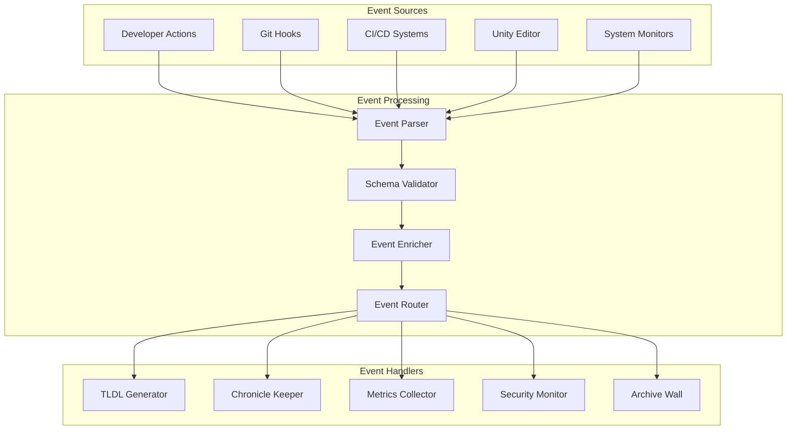

# 📋 Event Schemas v1.0

## Overview

The Living Dev Agent processes various types of events through a unified event system. This document defines the formal schemas for all event types, data flows, and integration patterns used throughout the system.

## Core Event Architecture

### Event Processing Pipeline



### Base Event Schema

All events in the system conform to this base schema:

```yaml
# Base Event Schema v1.0
$schema: "https://json-schema.org/draft/2020-12/schema"
$id: "https://livingdevagent.com/schemas/v1/base-event.json"
title: "LDA Base Event"
type: object
required:
  - event_id
  - event_type
  - timestamp
  - source
  - version
properties:
  event_id:
    type: string
    pattern: "^[a-f0-9]{8}-[a-f0-9]{4}-[a-f0-9]{4}-[a-f0-9]{4}-[a-f0-9]{12}$"
    description: "Unique UUID for the event"
  
  event_type:
    type: string
    enum:
      - "development_action"
      - "git_event"
      - "cicd_event"
      - "unity_event"
      - "system_event"
      - "security_event"
      - "documentation_event"
      - "validation_event"
      - "plugin_event"
    description: "High-level event category"
  
  event_subtype:
    type: string
    description: "Specific event subtype within category"
  
  timestamp:
    type: string
    format: date-time
    description: "ISO 8601 timestamp of event occurrence"
  
  source:
    type: object
    required:
      - system
      - component
    properties:
      system:
        type: string
        description: "Source system identifier"
      component:
        type: string
        description: "Specific component within system"
      user:
        type: string
        description: "User identifier (if applicable)"
    description: "Event source information"
  
  version:
    type: string
    pattern: "^\\d+\\.\\d+\\.\\d+$"
    description: "Event schema version"
  
  payload:
    type: object
    description: "Event-specific data payload"
  
  metadata:
    type: object
    properties:
      session_id:
        type: string
        description: "Development session identifier"
      correlation_id:
        type: string
        description: "Correlation ID for related events"
      tags:
        type: array
        items:
          type: string
        description: "Event classification tags"
      priority:
        type: integer
        minimum: 1
        maximum: 5
        description: "Event priority (1=critical, 5=informational)"
    description: "Additional event metadata"
```

## Development Event Schemas

### Code Change Event

```yaml
# Code Change Event Schema v1.0
$id: "https://livingdevagent.com/schemas/v1/code-change-event.json"
allOf:
  - $ref: "#/base-event"
  - type: object
    properties:
      event_subtype:
        enum: ["file_created", "file_modified", "file_deleted", "file_moved"]
      payload:
        type: object
        required:
          - files
          - commit_info
        properties:
          files:
            type: array
            items:
              type: object
              required:
                - path
                - action
              properties:
                path:
                  type: string
                  description: "File path relative to repository root"
                action:
                  type: string
                  enum: ["added", "modified", "deleted", "moved"]
                lines_added:
                  type: integer
                  minimum: 0
                lines_removed:
                  type: integer
                  minimum: 0
                language:
                  type: string
                  description: "Programming language detected"
          
          commit_info:
            type: object
            required:
              - sha
              - message
              - author
            properties:
              sha:
                type: string
                pattern: "^[a-f0-9]{40}$"
                description: "Git commit SHA"
              message:
                type: string
                description: "Commit message"
              author:
                type: object
                required:
                  - name
                  - email
                properties:
                  name:
                    type: string
                  email:
                    type: string
                    format: email
              timestamp:
                type: string
                format: date-time
```

### Build Event

```yaml
# Build Event Schema v1.0
$id: "https://livingdevagent.com/schemas/v1/build-event.json"
allOf:
  - $ref: "#/base-event"
  - type: object
    properties:
      event_subtype:
        enum: ["build_started", "build_completed", "build_failed", "test_executed"]
      payload:
        type: object
        required:
          - build_id
          - status
          - duration
        properties:
          build_id:
            type: string
            description: "Unique build identifier"
          
          status:
            type: string
            enum: ["success", "failure", "cancelled", "timeout"]
          
          duration:
            type: number
            minimum: 0
            description: "Build duration in seconds"
          
          platform:
            type: string
            description: "Target platform for build"
          
          configuration:
            type: string
            description: "Build configuration (debug, release, etc.)"
          
          artifacts:
            type: array
            items:
              type: object
              properties:
                name:
                  type: string
                path:
                  type: string
                size:
                  type: integer
                checksum:
                  type: string
          
          test_results:
            type: object
            properties:
              total_tests:
                type: integer
                minimum: 0
              passed_tests:
                type: integer
                minimum: 0
              failed_tests:
                type: integer
                minimum: 0
              test_duration:
                type: number
                minimum: 0
          
          errors:
            type: array
            items:
              type: object
              properties:
                type:
                  type: string
                message:
                  type: string
                file:
                  type: string
                line:
                  type: integer
                column:
                  type: integer
```

## Documentation Event Schemas

### TLDL Event

```yaml
# TLDL Event Schema v1.0
$id: "https://livingdevagent.com/schemas/v1/tldl-event.json"
allOf:
  - $ref: "#/base-event"
  - type: object
    properties:
      event_subtype:
        enum: ["tldl_created", "tldl_updated", "tldl_validated", "tldl_archived"]
      payload:
        type: object
        required:
          - entry_id
          - title
          - action
        properties:
          entry_id:
            type: string
            pattern: "^TLDL-\\d{4}-\\d{2}-\\d{2}-.+$"
            description: "TLDL entry identifier"
          
          title:
            type: string
            description: "TLDL entry title"
          
          action:
            type: string
            enum: ["created", "updated", "validated", "archived"]
          
          author:
            type: string
            description: "Entry author"
          
          file_path:
            type: string
            description: "Path to TLDL file"
          
          validation_status:
            type: string
            enum: ["passed", "failed", "warning"]
          
          validation_errors:
            type: array
            items:
              type: object
              properties:
                code:
                  type: string
                message:
                  type: string
                line:
                  type: integer
          
          related_files:
            type: array
            items:
              type: string
            description: "Files referenced in TLDL entry"
          
          chronicle_keeper_triggered:
            type: boolean
            description: "Whether Chronicle Keeper was triggered"
```

### Archive Wall Event

```yaml
# Archive Wall Event Schema v1.0
$id: "https://livingdevagent.com/schemas/v1/archive-wall-event.json"
allOf:
  - $ref: "#/base-event"
  - type: object
    properties:
      event_subtype:
        enum: ["capsule_created", "ledger_generated", "ghost_sweep", "oracle_vision"]
      payload:
        type: object
        properties:
          capsule_scroll:
            type: object
            properties:
              name:
                type: string
              timeframe:
                type: object
                properties:
                  start:
                    type: string
                    format: date-time
                  end:
                    type: string
                    format: date-time
              status:
                type: string
                enum: ["active", "archived", "completed"]
          
          daily_ledger:
            type: object
            properties:
              date:
                type: string
                format: date
              arc_name:
                type: string
              mode:
                type: string
              activities:
                type: array
                items:
                  type: object
                  properties:
                    type:
                      type: string
                    description:
                      type: string
                    timestamp:
                      type: string
                      format: date-time
          
          ghost_sweep:
            type: object
            properties:
              new_features:
                type: array
                items:
                  type: string
              capabilities:
                type: array
                items:
                  type: string
              detection_method:
                type: string
                enum: ["git_analysis", "file_scan", "manual"]
```

## Unity Integration Event Schemas

### Unity Editor Event

```yaml
# Unity Editor Event Schema v1.0
$id: "https://livingdevagent.com/schemas/v1/unity-event.json"
allOf:
  - $ref: "#/base-event"
  - type: object
    properties:
      event_subtype:
        enum: ["script_compiled", "scene_opened", "build_triggered", "tldl_wizard_opened", "asset_imported"]
      payload:
        type: object
        properties:
          unity_version:
            type: string
            description: "Unity Editor version"
          
          project_name:
            type: string
            description: "Unity project name"
          
          scene_info:
            type: object
            properties:
              name:
                type: string
              path:
                type: string
              objects_count:
                type: integer
          
          script_info:
            type: object
            properties:
              class_name:
                type: string
              namespace:
                type: string
              file_path:
                type: string
              compilation_time:
                type: number
              errors:
                type: array
                items:
                  type: object
                  properties:
                    message:
                      type: string
                    line:
                      type: integer
                    type:
                      type: string
                      enum: ["error", "warning", "info"]
          
          tldl_wizard:
            type: object
            properties:
              action:
                type: string
                enum: ["opened", "submitted", "cancelled"]
              template_used:
                type: string
              fields_completed:
                type: integer
          
          build_info:
            type: object
            properties:
              target:
                type: string
              platform:
                type: string
              configuration:
                type: string
              duration:
                type: number
```

## Security Event Schemas

### Security Scan Event

```yaml
# Security Scan Event Schema v1.0
$id: "https://livingdevagent.com/schemas/v1/security-event.json"
allOf:
  - $ref: "#/base-event"
  - type: object
    properties:
      event_subtype:
        enum: ["dependency_scan", "secret_scan", "static_analysis", "vulnerability_detected"]
      payload:
        type: object
        properties:
          scan_type:
            type: string
            enum: ["dependencies", "secrets", "static_analysis", "comprehensive"]
          
          scan_duration:
            type: number
            minimum: 0
            description: "Scan duration in seconds"
          
          findings:
            type: array
            items:
              type: object
              required:
                - severity
                - type
                - description
              properties:
                severity:
                  type: string
                  enum: ["critical", "high", "medium", "low", "info"]
                type:
                  type: string
                  enum: ["vulnerability", "secret", "code_quality", "configuration"]
                description:
                  type: string
                file:
                  type: string
                line:
                  type: integer
                rule_id:
                  type: string
                cve_id:
                  type: string
                  pattern: "^CVE-\\d{4}-\\d{4,}$"
                recommendation:
                  type: string
          
          dependencies:
            type: array
            items:
              type: object
              properties:
                name:
                  type: string
                version:
                  type: string
                ecosystem:
                  type: string
                  enum: ["pip", "npm", "nuget", "github-actions"]
                vulnerabilities:
                  type: array
                  items:
                    type: object
                    properties:
                      id:
                        type: string
                      severity:
                        type: string
                      summary:
                        type: string
          
          secrets_found:
            type: integer
            minimum: 0
            description: "Number of potential secrets detected"
          
          false_positives:
            type: integer
            minimum: 0
            description: "Number of confirmed false positives"
```

## System Event Schemas

### Performance Metric Event

```yaml
# Performance Metric Event Schema v1.0
$id: "https://livingdevagent.com/schemas/v1/performance-event.json"
allOf:
  - $ref: "#/base-event"
  - type: object
    properties:
      event_subtype:
        enum: ["validation_completed", "benchmark_executed", "resource_usage", "response_time"]
      payload:
        type: object
        properties:
          metric_type:
            type: string
            enum: ["response_time", "throughput", "memory_usage", "cpu_usage", "validation_time"]
          
          value:
            type: number
            description: "Metric value"
          
          unit:
            type: string
            enum: ["ms", "seconds", "bytes", "mb", "gb", "percent", "items_per_second"]
          
          benchmark_name:
            type: string
            description: "Name of benchmark or operation"
          
          target_value:
            type: number
            description: "Target/expected value for comparison"
          
          status:
            type: string
            enum: ["within_target", "exceeds_target", "below_target", "error"]
          
          context:
            type: object
            properties:
              operation:
                type: string
              file_count:
                type: integer
              data_size:
                type: integer
              system_load:
                type: number
          
          historical_comparison:
            type: object
            properties:
              previous_value:
                type: number
              change_percent:
                type: number
              trend:
                type: string
                enum: ["improving", "degrading", "stable"]
```

## Plugin Event Schemas

### Plugin Lifecycle Event

```yaml
# Plugin Lifecycle Event Schema v1.0
$id: "https://livingdevagent.com/schemas/v1/plugin-event.json"
allOf:
  - $ref: "#/base-event"
  - type: object
    properties:
      event_subtype:
        enum: ["plugin_loaded", "plugin_unloaded", "plugin_error", "plugin_executed"]
      payload:
        type: object
        required:
          - plugin_name
          - plugin_version
        properties:
          plugin_name:
            type: string
            description: "Plugin identifier"
          
          plugin_version:
            type: string
            pattern: "^\\d+\\.\\d+\\.\\d+$"
            description: "Plugin version"
          
          api_version:
            type: string
            pattern: "^\\d+\\.\\d+\\.\\d+$"
            description: "Required LDA API version"
          
          action:
            type: string
            enum: ["load", "unload", "execute", "error", "configure"]
          
          execution_time:
            type: number
            minimum: 0
            description: "Plugin execution time in milliseconds"
          
          permissions_used:
            type: array
            items:
              type: string
            description: "Permissions utilized during execution"
          
          result:
            type: object
            properties:
              success:
                type: boolean
              message:
                type: string
              data:
                type: object
              errors:
                type: array
                items:
                  type: string
          
          configuration:
            type: object
            description: "Plugin configuration at time of event"
```

## Event Routing and Processing

### Event Router Configuration

```yaml
# Event Router Configuration Schema v1.0
title: "Event Router Configuration"
type: object
properties:
  routes:
    type: array
    items:
      type: object
      required:
        - event_type
        - handlers
      properties:
        event_type:
          type: string
          description: "Event type pattern to match"
        
        event_subtype:
          type: string
          description: "Optional subtype filter"
        
        filters:
          type: array
          items:
            type: object
            properties:
              field:
                type: string
              operator:
                type: string
                enum: ["equals", "contains", "regex", "greater_than", "less_than"]
              value:
                oneOf:
                  - type: string
                  - type: number
                  - type: boolean
        
        handlers:
          type: array
          items:
            type: object
            required:
              - name
              - type
            properties:
              name:
                type: string
              type:
                type: string
                enum: ["tldl_generator", "chronicle_keeper", "metrics_collector", "security_monitor", "plugin"]
              configuration:
                type: object
              priority:
                type: integer
                minimum: 1
                maximum: 10
        
        rate_limit:
          type: object
          properties:
            events_per_minute:
              type: integer
              minimum: 1
            burst_size:
              type: integer
              minimum: 1
```

## Event Storage and Persistence

### Event Store Schema

Events are persisted with additional metadata for querying and analysis:

```yaml
# Event Store Schema v1.0
title: "Stored Event"
allOf:
  - $ref: "#/base-event"
  - type: object
    properties:
      storage_metadata:
        type: object
        required:
          - stored_at
          - retention_policy
        properties:
          stored_at:
            type: string
            format: date-time
            description: "Timestamp when event was stored"
          
          retention_policy:
            type: string
            enum: ["permanent", "1_year", "6_months", "3_months", "1_month"]
            description: "How long to retain this event"
          
          indexed_fields:
            type: array
            items:
              type: string
            description: "Fields indexed for fast querying"
          
          related_events:
            type: array
            items:
              type: string
            description: "IDs of related events"
          
          processing_status:
            type: string
            enum: ["pending", "processed", "failed", "retrying"]
            description: "Event processing status"
          
          processing_history:
            type: array
            items:
              type: object
              properties:
                handler:
                  type: string
                status:
                  type: string
                  enum: ["success", "failure", "skipped"]
                timestamp:
                  type: string
                  format: date-time
                duration:
                  type: number
                error_message:
                  type: string
```

## Integration Patterns

### External System Integration

For integrating with external systems, events can be:

1. **Pushed** via webhooks to external endpoints
2. **Pulled** via REST API queries
3. **Streamed** via WebSocket connections
4. **Queued** via message brokers (Redis, RabbitMQ)

### Event Transformation

Events can be transformed for external consumption:

```yaml
# Event Transformation Configuration
title: "Event Transformation Rule"
type: object
properties:
  name:
    type: string
    description: "Transformation rule name"
  
  source_schema:
    type: string
    description: "Source event schema version"
  
  target_schema:
    type: string
    description: "Target schema for transformation"
  
  field_mappings:
    type: array
    items:
      type: object
      properties:
        source_field:
          type: string
        target_field:
          type: string
        transformation:
          type: string
          enum: ["copy", "rename", "format", "calculate", "lookup"]
        parameters:
          type: object
  
  filters:
    type: array
    items:
      type: object
      description: "Conditions for applying transformation"
```

This comprehensive event schema documentation provides the foundation for all event processing in the Living Dev Agent system, ensuring consistent data structures and reliable integration patterns for v1.0 and beyond.