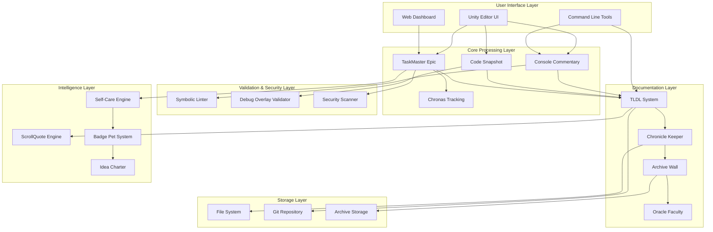
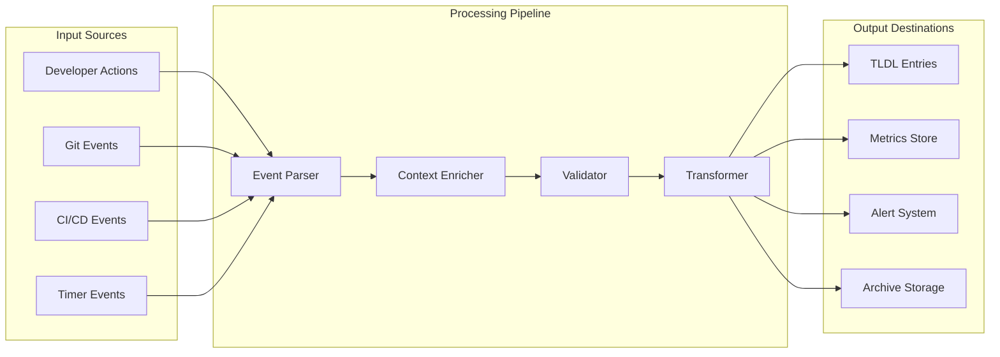

# 🏗️ System Architecture Overview

## Living Dev Agent (TLDA) System Architecture

The Living Dev Agent is a comprehensive development workflow automation system built around the principle of transforming development sessions into documented adventures. The system consists of multiple interconnected components that work together to provide debugging, documentation, project management, and cognitive safety features.

## High-Level Architecture

## Component Responsibilities

### User Interface Layer
- **Unity Editor UI**: Native Unity plugin interface for game development workflows
- **Command Line Tools**: Bash/Python scripts for automation and CI/CD integration
- **Web Dashboard**: HTML/JavaScript interface for project overview and metrics

### Core Processing Layer
- **Console Commentary**: Transform debugging sessions into documented learning experiences
- **Code Snapshot**: Capture perfect context with adjustable range controls (1-50 lines)
- **TaskMaster Epic**: Project management with adventure-driven organization
- **Chronas Tracking**: Professional time tracking with session persistence

### Documentation Layer
- **TLDL System**: Living Dev Log entries that chronicle development decisions
- **Chronicle Keeper**: Automated lore generation from development activities
- **Archive Wall**: Context preservation system for conversation continuity
- **Oracle Faculty**: Strategic analysis and future-sight for development decisions

### Validation & Security Layer
- **Symbolic Linter**: Multi-language code analysis with sub-200ms performance
- **Debug Overlay Validator**: Health scoring for development overlay systems
- **Security Scanner**: Multi-layered security analysis including dependencies and secrets

### Intelligence Layer
- **ScrollQuote Engine**: Context-aware inspirational quotes integrated into workflows
- **Self-Care Engine**: Cognitive safety monitoring and overflow management
- **Badge Pet System**: Gamification and evolution tracking for development activities
- **Idea Charter**: Structured creative spark capture and implementation tracking

## Data Flow Architecture

## Event Schema Architecture

The system processes various event types through a unified event processing pipeline:

### Core Event Types
1. **Development Events** - Code changes, debugging sessions, build activities
2. **Documentation Events** - TLDL creation, Chronicle Keeper automation
3. **Project Management Events** - Task creation, epic completion, time tracking
4. **Security Events** - Vulnerability detection, dependency updates
5. **Cognitive Events** - Self-care monitoring, overflow detection

### Event Processing Flow
1. **Event Capture** - Multiple input sources feed into unified event parser
2. **Context Enrichment** - Additional metadata and cross-references added
3. **Validation** - Event structure and content validation
4. **Transformation** - Convert to appropriate output format
5. **Storage** - Persist to appropriate storage layer

## Integration Points

### External Integrations
- **GitHub Actions**: Automated workflows and CI/CD integration
- **Unity Editor**: Native plugin integration for game development
- **Git**: Version control event processing and automation
- **Venmo**: Sponsor badge system payment processing

### Internal Integrations
- **Cross-component messaging**: Unified event bus for component communication
- **Shared state management**: Consistent state across all system components
- **Plugin architecture**: Extensible system for custom functionality

## Scalability Considerations

### Performance Characteristics
- **Sub-200ms validation**: All validation tools complete in under 200ms
- **Minimal memory footprint**: Efficient resource usage during processing
- **Graceful degradation**: System continues functioning when optional components unavailable

### Expansion Points
- **Plugin system**: Add custom functionality without core system changes
- **API contracts**: Versioned interfaces for external system integration
- **Modular architecture**: Components can be deployed independently

## Security Architecture

### Multi-Layer Security
1. **Input validation**: All user input sanitized and validated
2. **Dependency scanning**: Automated vulnerability detection in dependencies
3. **Secret scanning**: Prevent accidental credential exposure
4. **Static analysis**: Code quality and security issue detection

### Privacy Protection
- **Local processing**: Sensitive data processed locally when possible
- **Minimal data collection**: Only collect data necessary for functionality
- **User control**: Users control what data is shared and stored

This architecture provides a robust, scalable, and secure foundation for development workflow automation while maintaining the adventure-driven philosophy that makes development sessions engaging and well-documented.