# 🎯 Your First 15 Minutes: Hands-On TLDA Adventure

Welcome, future developer! This guide will take you from zero to creating your first documented development adventure in just 15 minutes. No prior experience needed - just curiosity and a willingness to learn.

## 🎮 What You'll Accomplish

By the end of this guide, you'll have:
- ✅ Set up TLDA in a practice project
- 📜 Created your first TLDL entry
- 📸 Captured your first code snapshot
- ⚡ Run quality validation tools
- 🧠 Understood how everything connects

## 🏁 Prerequisites: What You Need

- 🐍 Python 3.7+ installed
- 💻 A terminal/command prompt
- 📂 Ability to create files and folders
- 🎯 15 minutes of focused time

**Check if you're ready:**
```bash
python3 --version
# Should show something like: Python 3.8.5 or higher
```

If that doesn't work, try:
```bash
python --version
py --version
```

## 🗺️ Your Adventure Path

```mermaid
flowchart LR
    A[🎬 Create Practice Project] --> B[⚡ Setup TLDA]
    B --> C[📜 First TLDL Entry]
    C --> D[📸 Code Snapshot]
    D --> E[✅ Validation]
    E --> F[🎉 Victory!]
    
    style A fill:#e3f2fd
    style F fill:#c8e6c9
```



---

## 🎬 Step 1: Create Your Practice Project (2 minutes)

Let's create a small project to practice with:

```bash
# Create your practice castle
mkdir my-first-tlda-adventure
cd my-first-tlda-adventure

# Initialize git (TLDA needs this)
git init
git config user.name "Your Name"
git config user.email "your.email@example.com"

# Create a simple Python file to practice with
cat > hello_world.py << 'EOF'
def greet_user(name):
    """
    A friendly greeting function that demonstrates
    how TLDA captures code context.
    """
    if not name:
        return "Hello, mysterious stranger!"
    
    greeting = f"Hello, {name}! Welcome to TLDA!"
    print(greeting)
    return greeting

def main():
    # This is where we'll capture our first snapshot
    user_name = input("What's your name? ")
    message = greet_user(user_name)
    
    # Add some complexity for demonstration
    if "TLDA" in message:
        print("🎉 You're about to become a documentation wizard!")
    
    return message

if __name__ == "__main__":
    main()
EOF

# Test that it works
python3 hello_world.py
# Enter your name when prompted
```

**What just happened?**
- 📂 Created a project directory
- 🌳 Initialized Git (required for TLDA)
- 🐍 Created a simple Python script
- ✅ Verified everything works

---

## ⚡ Step 2: Setup TLDA Magic (3 minutes)

Now let's add TLDA to your project. We'll simulate the TLDA template setup:

```bash
# Create the required directories
mkdir -p .github/workflows
mkdir -p TLDL/entries
mkdir -p src/SymbolicLinter
mkdir -p src/CodeSnapshot
mkdir -p docs

# Create a simple TLDL template
cat > docs/tldl_template.yaml << 'EOF'
# TLDL Entry Template
title: "Entry Title"
metadata:
  entry_id: "TLDL-YYYY-MM-DD-Title"
  author: "Your Name"
  context: "Brief description"
  summary: "One sentence overview"

sections:
  objective: "What you were trying to accomplish"
  discovery: "What you learned"
  actions_taken: "Steps you took"
  key_insights: "Important lessons"
  next_steps: "What should happen next"
EOF

# Create a simple validation script
cat > validate_simple.py << 'EOF'
#!/usr/bin/env python3
"""Simple validation script for demonstration"""
import os
import glob

def validate_tldl_files():
    tldl_files = glob.glob("TLDL/entries/*.md")
    print(f"🔍 Found {len(tldl_files)} TLDL files")
    
    for file in tldl_files:
        with open(file, 'r') as f:
            content = f.read()
            if '## Objective' in content:
                print(f"✅ {os.path.basename(file)}: Has objective section")
            else:
                print(f"⚠️ {os.path.basename(file)}: Missing objective section")
    
    print("🎉 Validation complete!")

if __name__ == "__main__":
    validate_tldl_files()
EOF

chmod +x validate_simple.py

# Create a simple snapshot script
cat > capture_snapshot.py << 'EOF'
#!/usr/bin/env python3
"""Simple code snapshot script for demonstration"""
import sys

def capture_code_snapshot(filename, line_number, context_lines=5):
    try:
        with open(filename, 'r') as f:
            lines = f.readlines()
        
        start_line = max(0, line_number - 1 - context_lines)
        end_line = min(len(lines), line_number + context_lines)
        
        print(f"📸 Code Snapshot: {filename}:{line_number}")
        print("=" * 50)
        
        for i in range(start_line, end_line):
            marker = ">>>" if i == line_number - 1 else "   "
            print(f"{marker} {i+1:3d}: {lines[i].rstrip()}")
        
        print("=" * 50)
        print(f"✨ Captured {end_line - start_line} lines with {context_lines} lines of context")
        
    except FileNotFoundError:
        print(f"❌ File not found: {filename}")
    except Exception as e:
        print(f"❌ Error: {e}")

if __name__ == "__main__":
    if len(sys.argv) != 3:
        print("Usage: python3 capture_snapshot.py <filename> <line_number>")
        sys.exit(1)
    
    filename = sys.argv[1]
    line_number = int(sys.argv[2])
    capture_code_snapshot(filename, line_number)
EOF

chmod +x capture_snapshot.py

echo "🎉 TLDA setup complete! Your castle is ready."
```

**What just happened?**
- 📁 Created TLDA directory structure
- 📜 Set up TLDL template system
- ⚡ Created simple validation tools
- 📸 Built basic code snapshot capability

---

## 📜 Step 3: Create Your First TLDL Entry (4 minutes)

Time to document your first development adventure:

```bash
# Create your first TLDL entry
cat > TLDL/entries/TLDL-$(date +%Y-%m-%d)-MyFirstTLDAAdventure.md << 'EOF'
# 🎉 My First TLDA Adventure

## Metadata
- **Entry ID:** TLDL-2024-01-15-MyFirstTLDAAdventure
- **Author:** Your Name
- **Context:** Learning how to use TLDA for development documentation
- **Summary:** Successfully set up TLDA and created my first documented development experience

## 🎯 Objective
Learn how to use the Living Dev Agent (TLDA) system by:
- Setting up a practice project
- Creating my first TLDL entry
- Capturing code snapshots
- Understanding the validation process

## 🔍 Discovery
The TLDA system is actually quite intuitive! Key discoveries:
- **TLDL entries are just markdown files** with a specific structure
- **Code snapshots capture perfect context** around any line of code
- **Validation tools run quickly** and provide helpful feedback
- **Everything is designed to enhance, not interrupt** my coding flow

## ⚡ Actions Taken
1. **Project Setup:**
   - Created `my-first-tlda-adventure` directory
   - Initialized Git repository
   - Created a simple Python script (`hello_world.py`)

2. **TLDA Installation:**
   - Set up required directory structure
   - Created TLDL template system
   - Built simple validation and snapshot tools

3. **First Documentation:**
   - Created this TLDL entry
   - Documented my learning process
   - Prepared to test code snapshot functionality

## 💡 Key Insights
- **Documentation as part of development:** TLDA makes it natural to document as I work, not as an afterthought
- **Visual and narrative approach:** The adventure metaphor and visual guides make complex systems approachable
- **Incremental learning:** I can start simple and gradually use more advanced features
- **Quality feedback:** Having validation tools gives confidence that I'm doing things right

## 🚀 Next Steps
- [ ] Capture my first code snapshot
- [ ] Run validation tools to ensure everything is correct
- [ ] Explore more TLDA features like the self-care engine
- [ ] Start using TLDA in my real development projects
- [ ] Share this knowledge with teammates

## 🔗 Related Links
- [TLDA Documentation](../docs/)
- [Visual Guide](../docs/onboarding/visual-guide.md)
- Practice file: `hello_world.py`

---

*This entry represents my first step into documented development adventures. Looking forward to building this knowledge over time!* ✨
EOF

echo "📜 First TLDL entry created!"
echo "📍 Location: TLDL/entries/TLDL-$(date +%Y-%m-%d)-MyFirstTLDAAdventure.md"
```

**What just happened?**
- 📝 Created a properly formatted TLDL entry
- 🧠 Documented your learning process
- 📅 Used standard naming convention
- 🔗 Included links to related resources

---

## 📸 Step 4: Capture Your First Code Snapshot (3 minutes)

Let's capture some code context to understand how this works:

```bash
# Capture a snapshot of the greeting function
python3 capture_snapshot.py hello_world.py 5

# The output shows line 5 (the if statement) with context
```

You should see something like:
```
📸 Code Snapshot: hello_world.py:5
==================================================
    1: def greet_user(name):
    2:     """
    3:     A friendly greeting function that demonstrates
    4:     how TLDA captures code context.
    5:     """
>>> 6:     if not name:
    7:         return "Hello, mysterious stranger!"
    8:     
    9:     greeting = f"Hello, {name}! Welcome to TLDA!"
   10:     print(greeting)
   11:     return greeting
==================================================
✨ Captured 11 lines with 5 lines of context
```

Now let's capture a different section:
```bash
# Capture the main function logic
python3 capture_snapshot.py hello_world.py 18

# This shows the core logic with surrounding context
```

**Let's add the snapshot to our TLDL entry:**
```bash
# Append code snapshot to your TLDL entry
cat >> TLDL/entries/TLDL-$(date +%Y-%m-%d)-MyFirstTLDAAdventure.md << 'EOF'

## 📸 Code Snapshots

### Greeting Function Logic
```python
# Snapshot of hello_world.py:6 - Input validation
if not name:
    return "Hello, mysterious stranger!"

greeting = f"Hello, {name}! Welcome to TLDA!"
print(greeting)
return greeting
```

### Main Function Flow
```python
# Snapshot of hello_world.py:18 - Main program logic
user_name = input("What's your name? ")
message = greet_user(user_name)

# Add some complexity for demonstration
if "TLDA" in message:
    print("🎉 You're about to become a documentation wizard!")
```

**Context:** These snapshots demonstrate how TLDA captures just the right amount of code context for different purposes.
EOF
```

**What just happened?**
- 📸 Captured code snapshots with perfect context
- 🎯 Learned how to target specific lines
- 📝 Added visual context to your TLDL entry
- 🧠 Understood the power of contextual documentation

---

## ✅ Step 5: Validate Your Work (2 minutes)

Time to check that everything is working correctly:

```bash
# Run validation on your TLDL entry
python3 validate_simple.py

# You should see output like:
# 🔍 Found 1 TLDL files
# ✅ TLDL-2024-01-15-MyFirstTLDAAdventure.md: Has objective section
# 🎉 Validation complete!

# Check your project structure
echo "📁 Project structure:"
find . -type f -name "*.md" -o -name "*.py" | head -10

# Commit your work to git
git add .
git commit -m "🎉 First TLDA adventure complete

- Set up TLDA structure
- Created first TLDL entry documenting the learning process
- Captured code snapshots with context
- Validated documentation quality

This represents the foundation for documented development adventures!"

echo "🎉 Validation complete and work committed!"
```

**What just happened?**
- ✅ Verified your TLDL entry follows the correct format
- 📁 Confirmed all files are in the right places
- 💾 Committed your work to preserve this learning
- 🎯 Validated that you understand the core concepts

---

## 🎉 Step 6: Celebrate Your Victory! (1 minute)

Congratulations! You've just completed your first TLDA adventure. Let's review what you accomplished:

```bash
# Generate a success report
echo "🏆 ADVENTURE COMPLETE! 🏆"
echo "=========================="
echo "📊 Your Achievements:"
echo "✅ Set up TLDA project structure"
echo "✅ Created properly formatted TLDL entry"
echo "✅ Captured meaningful code snapshots"
echo "✅ Validated documentation quality"
echo "✅ Committed knowledge to Git"
echo ""
echo "📈 Skills Unlocked:"
echo "🧠 Understanding of TLDA concepts"
echo "📝 TLDL entry creation"
echo "📸 Code snapshot capture"
echo "⚡ Quality validation"
echo "🎮 Adventure-driven documentation"
echo ""
echo "🚀 Ready for Next Level:"
echo "🏗️ Real project integration"
echo "🤝 Team collaboration"
echo "🔧 Advanced TLDA features"
echo "🧙‍♂️ Becoming a documentation wizard"
```

Run your hello world program one more time to celebrate:
```bash
python3 hello_world.py
# Enter your name and enjoy the greeting!
```

---

## 🎯 What You've Learned

### 🧠 Core Concepts Mastered
- **📜 TLDL Entries:** Living documentation that grows with your work
- **📸 Code Snapshots:** Perfect context capture for any code section
- **⚡ Validation:** Quick quality checks that ensure documentation standards
- **🎮 Adventure Approach:** Making documentation feel like completing quests

### 🛠️ Practical Skills Gained
- Setting up TLDA project structure
- Creating well-formatted documentation
- Capturing meaningful code context
- Running quality validation tools
- Understanding the development-to-documentation workflow

### 🚀 Next Level Opportunities
- **Real Project Integration:** Apply these skills to your actual development work
- **Team Collaboration:** Help teammates understand and adopt TLDA
- **Advanced Features:** Explore self-care engine, oracle faculty, and more
- **Community Contribution:** Share your experiences and help improve TLDA

---

## 🎮 Choose Your Next Adventure

### 🥚 Rookie Path: Build on the Basics
- Apply TLDA to a small personal project
- Create 5 more TLDL entries for different types of work
- Practice using different code snapshot contexts
- Explore the tutorial quests system

### ⚔️ Apprentice Path: Team Integration
- Set up TLDA in a team project
- Create onboarding documentation for teammates
- Establish team TLDL standards and practices
- Start using advanced validation features

### 🏆 Master Path: Full System Exploration
- Dive into the complete TLDA architecture
- Contribute to TLDA documentation and features
- Mentor others in adventure-driven development
- Lead the transformation of your organization's documentation culture

---

## 🔗 Continue Your Journey

### 📚 Essential Next Reads
- **[Mind-Castle Visual Guide](visual-guide.md)** - Understand the complete system architecture
- **[Feature Spotlights](../features/feature-spotlights.md)** - Discover all the powerful tools available
- **[Process Maps](../workflows/process-maps.md)** - Learn workflows for real development scenarios
- **[Tutorial Quests](../../tutorials/README.md)** - Hands-on challenges to build your skills

### 🤝 Get Support
- **[Glossary & Quick Reference](../reference/glossary.md)** - Your TLDA dictionary
- **[Troubleshooting Guide](../reference/glossary.md#-troubleshooting-quick-fixes-emergency-spells)** - Solutions to common issues
- **[Contributing Guide](../../CONTRIBUTING.md)** - Help make TLDA even better

---

## 💬 Share Your Experience

**What worked well?** What confused you? What would you like to see improved?

Your feedback helps make TLDA better for future adventurers. Consider:
- Creating a TLDL entry about your learning experience
- Sharing this guide with colleagues interested in better documentation
- Contributing improvements to the onboarding process

---

*🎉 Congratulations on completing your first TLDA adventure! You're now ready to transform your development work into well-documented, knowledge-building experiences. The castle awaits your next quest!* ✨

**[← Back to Visual Guide](visual-guide.md)** | **[Next: Feature Spotlights →](../features/feature-spotlights.md)**