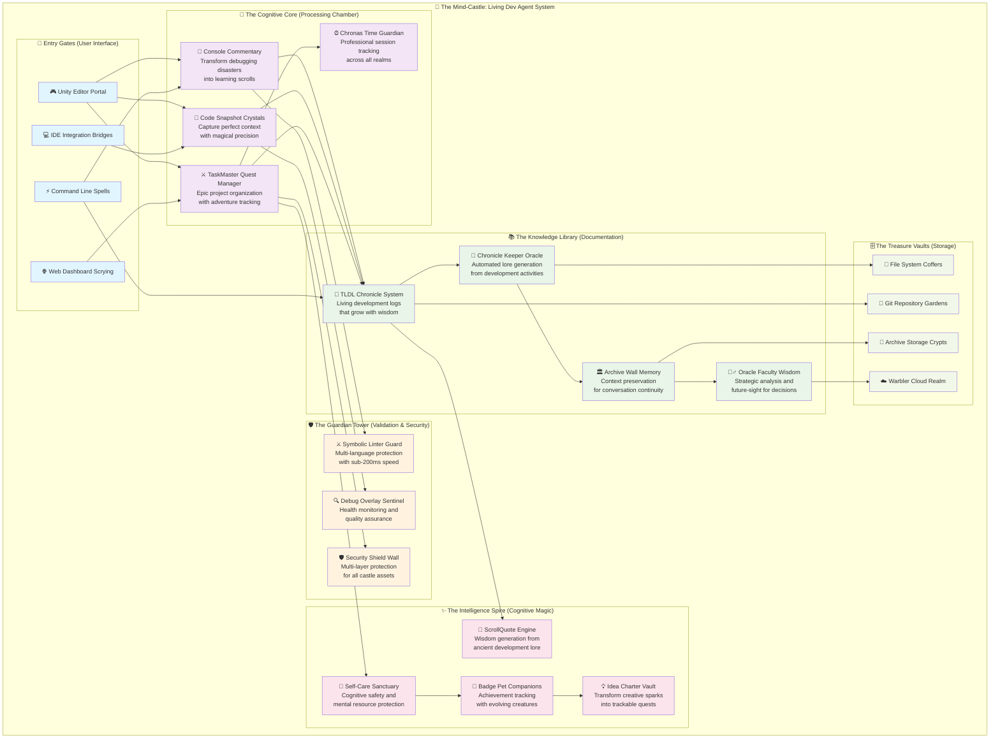
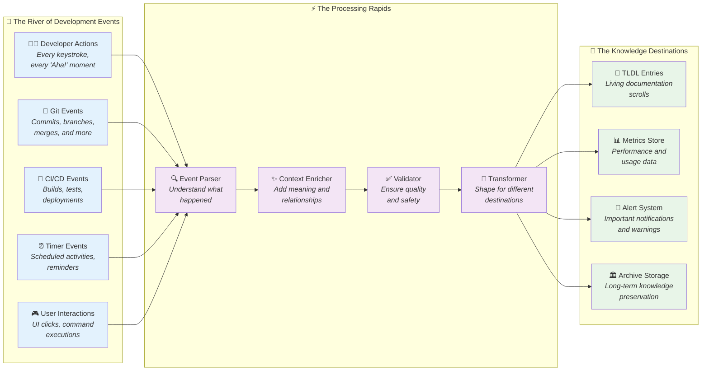

# 🏰 Mind-Castle Visual Guide: Understanding TLDA + Warbler CDA

## 🎯 Welcome, Future Developer!

Think of the Living Dev Agent as a **mind-castle** - a magical fortress where your development thoughts, code, and ideas are transformed into powerful documented knowledge. This guide will help you navigate this castle room by room.

## 🏗️ The Mind-Castle Architecture

### The Living Dev Agent Mind-Castle



## 🌊 The Data Flow Rivers

Think of data flowing through the mind-castle like magical rivers connecting different chambers:



## 🎮 Your First Quest: Understanding the Rooms

### 🚪 Entry Gates: How You Enter the Castle

1. **🎮 Unity Editor Portal**: For game developers working in Unity
2. **⚡ Command Line Spells**: For terminal wizards who prefer typing
3. **🌐 Web Dashboard Scrying**: For visual overview and metrics
4. **💻 IDE Integration Bridges**: For your favorite code editor

### 🧠 The Cognitive Core: Where Magic Happens

This is the heart of the castle where your development work transforms into knowledge:

- **💬 Console Commentary**: Turns your debugging sessions into learning stories
- **📸 Code Snapshot Crystals**: Captures the perfect amount of code context
- **⚔️ TaskMaster Quest Manager**: Organizes your work like epic adventures
- **⏰ Chronas Time Guardian**: Tracks where your development time actually goes

### 📚 The Knowledge Library: Where Wisdom Lives

All your development knowledge gets stored and organized here:

- **📜 TLDL Chronicle System**: Your living development log that grows with you
- **🔮 Chronicle Keeper Oracle**: Automatically creates stories from your work
- **🏛️ Archive Wall Memory**: Remembers important conversations and context
- **🧙‍♂️ Oracle Faculty Wisdom**: Provides strategic insights about your project

## 🎯 Quick Start: Your First 5 Minutes

### Step 1: Enter Through the Command Line Gate
```bash
# Open the castle gates
cd your-project
scripts/init_agent_context.sh
```

### Step 2: Create Your First Chronicle Entry
```bash
# Start documenting your quest
scripts/init_agent_context.sh --create-tldl "MyFirstAdventure"
```

### Step 3: Capture Your First Code Snapshot
```bash
# Take a magical photo of your code
python3 src/CodeSnapshot/code_snapshot.py your-file.py 42 --preset standard
```

### Step 4: Validate Your Castle's Health
```bash
# Check if everything is working properly
python3 src/SymbolicLinter/validate_docs.py --tldl-path TLDL/entries/
```

## 🎓 Learning Path: From Novice to Castle Master

### 🥚 Rookie Level: Understanding the Basics
- [ ] Complete your first TLDL entry
- [ ] Take 5 code snapshots
- [ ] Run validation tools successfully
- [ ] Understand the main castle rooms

### ⚔️ Apprentice Level: Using the Tools
- [ ] Set up automated chronicle generation
- [ ] Create your first TaskMaster epic
- [ ] Use the self-care engine for cognitive protection
- [ ] Integrate with your favorite IDE

### 🏆 Master Level: Castle Architecture
- [ ] Understand the complete data flow
- [ ] Create custom plugins and integrations
- [ ] Contribute to the castle's documentation
- [ ] Help other developers navigate the castle

## 🤔 Common Questions

### "What makes this different from other documentation tools?"
The Living Dev Agent doesn't just store documentation - it actively helps you create it as part of your natural development process. It's like having a wise chronicler following you around, turning your work into stories.

### "Will this slow down my development?"
The castle is designed for speed! Most validation operations complete in under 200ms. The tools work in the background, enhancing rather than interrupting your flow.

### "Can I use this with my existing tools?"
Absolutely! The castle integrates with Git, most IDEs, CI/CD systems, and development workflows. It's designed to enhance, not replace, your current setup.

## 🚀 Ready to Begin Your Adventure?

Welcome to the mind-castle! Your development journey is about to become much more magical and well-documented. Start with the quick steps above, and remember - every great developer started as a curious novice exploring their first castle.

*May your code be bug-free and your documentation ever-growing!* ✨

---

**Next Steps:**
- 📖 [Complete Onboarding Guide](../README.md#quick-start-30-seconds-to-adventure-ready-setup)
- 🏗️ [System Architecture Deep Dive](../architecture/system-overview.md)
- 🎯 [Tutorial Quests](../../tutorials/README.md)
