# 🗺️ Process Maps: Your Step-by-Step Guide to TLDA Workflows

Welcome to the workflow navigation center! Think of these as GPS directions for your development adventures. Each process map shows you exactly how to accomplish common tasks, from your first setup to advanced integrations.

## 🎯 Quick Navigation

- [🚀 First-Time Setup](#first-time-setup-from-zero-to-hero)
- [📜 Creating TLDL Entries](#creating-tldl-entries-documenting-your-journey)
- [🔍 Debugging Session Workflow](#debugging-session-workflow-turning-problems-into-knowledge)
- [🏗️ New Feature Development](#new-feature-development-epic-quest-management)
- [🛡️ Quality Assurance Process](#quality-assurance-process-validation-and-safety)
- [🎯 Project Onboarding](#project-onboarding-welcoming-new-adventurers)

---

## First-Time Setup: From Zero to Hero

**Goal:** Get TLDA running in your project within 5 minutes

### 🗺️ The Journey Map

```mermaid
flowchart TD
    A[🎬 Start: Fresh Project] --> B{📦 Have Git repo?}
    B -->|No| C[🌱 Initialize Git<br/><code>git init</code>]
    B -->|Yes| D[📂 Navigate to project<br/><code>cd your-project</code>]
    C --> D
    
    D --> E[🔧 Create required directories<br/><code>mkdir -p .github/workflows</code>]
    E --> F[🐍 Install Python dependencies<br/><code>pip install -r scripts/requirements.txt</code>]
    F --> G[⚡ Make scripts executable<br/><code>chmod +x scripts/*.sh</code>]
    
    G --> H[🧙‍♂️ Initialize the castle<br/><code>scripts/init_agent_context.sh</code>]
    H --> I[✅ Validate setup<br/><code>python3 src/SymbolicLinter/validate_docs.py --tldl-path TLDL/entries/</code>]
    
    I --> J{🎯 All green?}
    J -->|Yes| K[🎉 Success! Ready for adventure]
    J -->|No| L[🔧 Check error messages<br/>Fix issues and retry]
    L --> I
    
    K --> M[📜 Create first TLDL<br/><code>scripts/init_agent_context.sh --create-tldl "SetupComplete"</code>]
    
    style A fill:#e3f2fd
    style K fill:#c8e6c9
    style L fill:#ffcdd2
    style M fill:#fff3e0
```

### 📋 Checkpoint Checklist

- [ ] Git repository initialized
- [ ] Python 3.x available
- [ ] Scripts are executable
- [ ] No validation errors
- [ ] First TLDL entry created

### 🆘 Common Issues & Solutions

| Problem | Solution |
|---------|----------|
| 🐍 Python not found | Install Python 3.7+ or use `python3` instead of `python` |
| 📦 pip install fails | Network timeout is OK - core libraries usually pre-installed |
| 🔒 Permission denied | Run `chmod +x scripts/*.sh` to make scripts executable |
| ❌ Validation fails | Check TLDL entry format - see template in `docs/tldl_template.yaml` |

---

## Creating TLDL Entries: Documenting Your Journey

**Goal:** Transform your development work into valuable documentation

### 🗺️ The Documentation Flow

```mermaid
flowchart TD
    A[💡 Development event occurs] --> B{📝 What type of entry?}
    
    B -->|🔧 Technical work| C[🛠️ Implementation Entry]
    B -->|🐛 Problem solving| D[🔍 Discovery Entry]
    B -->|🎯 Planning| E[📋 Strategy Entry]
    B -->|🎉 Achievement| F[🏆 Milestone Entry]
    
    C --> G[📅 Create entry file<br/><code>TLDL-YYYY-MM-DD-Title.md</code>]
    D --> G
    E --> G
    F --> G
    
    G --> H[✍️ Fill in sections:<br/>• Objective<br/>• Actions Taken<br/>• Key Insights<br/>• Next Steps]
    
    H --> I[🔗 Add code snapshots<br/><code>python3 src/CodeSnapshot/code_snapshot.py file.py line --preset standard</code>]
    
    I --> J[✅ Validate entry<br/><code>python3 src/SymbolicLinter/validate_docs.py --tldl-path TLDL/entries/</code>]
    
    J --> K{🎯 Validation passed?}
    K -->|Yes| L[💾 Commit to repository<br/><code>git add . && git commit -m "docs: add TLDL entry"</code>]
    K -->|No| M[🔧 Fix validation issues]
    M --> J
    
    L --> N[🎉 Knowledge preserved!]
    
    style A fill:#e3f2fd
    style N fill:#c8e6c9
    style M fill:#ffcdd2
```

### 📱 Quick Commands

```bash
# Create new TLDL entry (automated)
scripts/init_agent_context.sh --create-tldl "FeatureName"

# Manual creation
cp docs/tldl_template.yaml TLDL/entries/TLDL-$(date +%Y-%m-%d)-MyEntry.md

# Add code context
python3 src/CodeSnapshot/code_snapshot.py src/myfile.py 42 --preset standard

# Validate before committing
python3 src/SymbolicLinter/validate_docs.py --tldl-path TLDL/entries/
```

### 🎯 Pro Tips

- **Use descriptive titles** - Future you will thank you
- **Add code snapshots** for technical entries
- **Cross-reference related entries** using links
- **Update existing entries** when continuing work

---

## Debugging Session Workflow: Turning Problems into Knowledge

**Goal:** Transform debugging disasters into documented learning experiences

### 🗺️ The Problem-Solving Quest

```mermaid
flowchart TD
    A[🐛 Bug discovered] --> B[📋 Start debugging session<br/><code>python3 src/ConsoleCommentary/console_commentary.py --session debug-001</code>]
    
    B --> C[🔍 Investigate the problem]
    C --> D[📸 Capture code context<br/><code>python3 src/CodeSnapshot/code_snapshot.py file.py line --preset wide</code>]
    
    D --> E[💭 Document hypothesis<br/>Add comment to session]
    E --> F[🧪 Test solution]
    
    F --> G{✅ Problem solved?}
    G -->|No| H[📝 Document what didn't work]
    H --> C
    
    G -->|Yes| I[🎯 Capture final solution<br/>Take snapshot of fixed code]
    I --> J[📜 Create TLDL entry<br/>Document the entire journey]
    
    J --> K[🏷️ Tag entry with:<br/>• Problem type<br/>• Solution approach<br/>• Tools used]
    
    K --> L[🔗 Link to related issues<br/>Connect to broader patterns]
    L --> M[🎉 Debugging knowledge gained!]
    
    style A fill:#ffcdd2
    style M fill:#c8e6c9
    style H fill:#fff3e0
```



### 📋 Debugging Session Template

```markdown
# 🐛 Debug Session: [Problem Name]

## 🎯 Problem Statement
- **What's broken:** [Clear description]
- **Expected behavior:** [What should happen]
- **Actual behavior:** [What actually happens]
- **Error messages:** [Exact error text]

## 🔍 Investigation Steps
1. [First thing you tried]
2. [Second approach]
3. [Key discovery moment]

## 💡 Solution
- **Root cause:** [What actually caused the issue]
- **Fix applied:** [Specific changes made]
- **Code changes:** [Link to snapshots]

## 🧠 Key Insights
- **Lessons learned:** [What you'll remember]
- **Prevention:** [How to avoid this in future]
- **Related patterns:** [Similar issues to watch for]
```

### 🛠️ Essential Commands

```bash
# Start debugging session with commentary
python3 src/ConsoleCommentary/console_commentary.py --session "bug-fix-auth"

# Capture problematic code
python3 src/CodeSnapshot/code_snapshot.py auth.py 156 --preset wide --context "Error location"

# Add insights during debugging
python3 src/ConsoleCommentary/console_commentary.py --session "bug-fix-auth" --add-comment "hypothesis" "Think it's a null reference issue"

# Capture the solution
python3 src/CodeSnapshot/code_snapshot.py auth.py 156 --preset standard --context "Fixed version"

# Create comprehensive TLDL entry
scripts/init_agent_context.sh --create-tldl "AuthBugFix"
```

---

## New Feature Development: Epic Quest Management

**Goal:** Organize feature development as manageable, documented adventures

### 🗺️ The Epic Journey

```mermaid
flowchart TD
    A[💡 Feature idea conceived] --> B[📋 Create feature charter<br/>Define scope and goals]
    
    B --> C[🎯 Create TLDL planning entry<br/>Document requirements and approach]
    C --> D[⚔️ Break into manageable tasks<br/>Create task hierarchy]
    
    D --> E[🏁 Start first task]
    E --> F[👨‍💻 Implement functionality]
    F --> G[📸 Capture key code sections<br/>Document important decisions]
    
    G --> H[🧪 Test implementation]
    H --> I{✅ Task complete?}
    I -->|No| J[🔧 Iterate and improve]
    J --> F
    
    I -->|Yes| K[📜 Update TLDL with progress<br/>Document lessons learned]
    K --> L{🎯 More tasks?}
    L -->|Yes| M[⏭️ Move to next task]
    M --> E
    
    L -->|No| N[🎉 Feature complete!]
    N --> O[📊 Create completion TLDL<br/>Summarize entire journey]
    
    O --> P[🔍 Validate all documentation<br/>Ensure knowledge is preserved]
    P --> Q[🚀 Feature ready for release!]
    
    style A fill:#e3f2fd
    style Q fill:#c8e6c9
    style J fill:#fff3e0
```



### 📋 Feature Development Checklist

#### 🎯 Planning Phase

- [ ] Feature charter created with clear goals
- [ ] Requirements documented in TLDL entry
- [ ] Tasks broken down into manageable pieces
- [ ] Success criteria defined

#### 🛠️ Implementation Phase

- [ ] Each major milestone documented
- [ ] Code snapshots captured for complex sections
- [ ] Design decisions explained
- [ ] Testing approach documented

#### 🎉 Completion Phase

- [ ] Feature summary TLDL created
- [ ] All documentation validated
- [ ] Knowledge gaps identified and filled
- [ ] Lessons learned captured

### 🚀 Power Commands

```bash
# Start feature development
scripts/init_agent_context.sh --create-tldl "FeaturePlanning-UserDashboard"

# Document architecture decisions
python3 src/CodeSnapshot/code_snapshot.py src/dashboard/main.py 1 --preset wide --context "Architecture overview"

# Track progress
scripts/init_agent_context.sh --create-tldl "FeatureProgress-UserDashboard-Week1"

# Complete feature documentation
scripts/init_agent_context.sh --create-tldl "FeatureComplete-UserDashboard"
```

---

## Quality Assurance Process: Validation and Safety

**Goal:** Ensure your code and documentation meet high quality standards

### 🗺️ The Quality Quest

```mermaid
flowchart TD
    A[📝 Code/docs ready for review] --> B[⚡ Run quick validation<br/><code>python3 src/SymbolicLinter/validate_docs.py --tldl-path TLDL/entries/</code>]
    
    B --> C{🎯 Quick check passed?}
    C -->|No| D[🔧 Fix obvious issues<br/>Retry validation]
    D --> B
    
    C -->|Yes| E[🔍 Run comprehensive scan<br/>All validation tools]
    
    E --> F[📊 Review validation report<br/>Check all metrics]
    F --> G{🏆 All checks green?}
    
    G -->|No| H[📋 Prioritize issues<br/>Critical → Warning → Info]
    H --> I[🔨 Fix high-priority issues]
    I --> E
    
    G -->|Yes| J[🎉 Quality standards met!]
    J --> K[📄 Generate quality report<br/>For team review]
    K --> L[✅ Ready for production]
    
    style A fill:#e3f2fd
    style L fill:#c8e6c9
    style D fill:#fff3e0
    style I fill:#ffcdd2
```



### 🔍 Validation Command Arsenal

```bash
# Quick health check (under 200ms total)
python3 src/SymbolicLinter/validate_docs.py --tldl-path TLDL/entries/
python3 src/DebugOverlayValidation/debug_overlay_validator.py --path src/DebugOverlayValidation/
python3 src/SymbolicLinter/symbolic_linter.py --path src/

# Full project analysis
scripts/cid-faculty/index.js --analyze-project

# Security focused scan
python3 src/SecurityScanner/security_scanner.py --path . --detailed

# Performance validation
python3 src/PerformanceMonitor/performance_monitor.py --validate-benchmarks
```

### 📊 Quality Metrics Dashboard

| Metric | Target | Command |
|--------|--------|---------|
| 📜 TLDL Coverage | >80% | `validate_docs.py --coverage` |
| 🔍 Code Quality | A Grade | `symbolic_linter.py --grade` |
| 🛡️ Security Score | >95% | `security_scanner.py --score` |
| ⚡ Performance | <200ms | `performance_monitor.py --benchmark` |

---

## Project Onboarding: Welcoming New Adventurers

**Goal:** Help new team members become productive quickly with excellent documentation

### 🗺️ The Welcome Journey

```mermaid
flowchart TD
    A[🆕 New team member arrives] --> B[📚 Provide onboarding guide<br/>Share visual guide and README]
    
    B --> C[🚀 Guide through setup process<br/>Follow first-time setup workflow]
    C --> D[🎯 Assign starter quest<br/>Small, well-documented task]
    
    D --> E[🤝 Pair with experienced developer<br/>Knowledge transfer session]
    E --> F[📜 Review project TLDL history<br/>Understand recent decisions]
    
    F --> G[🏗️ Explain system architecture<br/>Walk through mind-castle guide]
    G --> H[🛠️ Set up development environment<br/>Validate all tools working]
    
    H --> I[📝 First contribution<br/>Create onboarding TLDL entry]
    I --> J[🔍 Code review process<br/>Learn quality standards]
    
    J --> K[📊 Progress check<br/>Address any questions]
    K --> L{🎯 Feeling confident?}
    L -->|No| M[🔄 Additional support<br/>More pairing sessions]
    M --> K
    
    L -->|Yes| N[🎉 Onboarding complete!<br/>Full team member]
    N --> O[📈 Monitor progress<br/>Regular check-ins]
    
    style A fill:#e3f2fd
    style N fill:#c8e6c9
    style M fill:#fff3e0
```



### 📋 Onboarding Checklist for New Developers

#### 🎯 Day 1: Foundation

- [ ] Repository access granted
- [ ] Development environment setup completed
- [ ] First TLDL entry created
- [ ] Understanding of basic workflows

#### 🛠️ Week 1: Tools and Processes

- [ ] Familiar with all TLDA tools
- [ ] Completed first code contribution
- [ ] Participated in code review
- [ ] Understanding of quality standards

#### 🚀 Month 1: Full Integration

- [ ] Contributing to feature development
- [ ] Creating valuable TLDL entries
- [ ] Helping onboard next new developer
- [ ] Identifying improvement opportunities

### 🎯 Onboarding Resources

```bash
# Create onboarding package
scripts/generate-onboarding-package.sh new-developer-name

# Track onboarding progress
scripts/init_agent_context.sh --create-tldl "Onboarding-$(date +%Y-%m-%d)-NewDeveloperName"

# Generate team introduction materials
python3 scripts/team-intro-generator.py --new-member "Developer Name"
```

---

## 🚀 Next Steps

### 🎯 Choose Your Adventure

- **New to TLDA?** Start with [First-Time Setup](#first-time-setup-from-zero-to-hero)
- **Ready to document?** Jump to [Creating TLDL Entries](#creating-tldl-entries-documenting-your-journey)
- **Debugging issues?** Follow [Debugging Session Workflow](#debugging-session-workflow-turning-problems-into-knowledge)
- **Building features?** Use [New Feature Development](#new-feature-development-epic-quest-management)

### 📚 Explore More

- **[Feature Spotlights](../features/feature-spotlights.md)** - Discover what makes TLDA special
- **[Mind-Castle Visual Guide](../onboarding/visual-guide.md)** - Understand the system architecture
- **[Tutorial Quests](../../tutorials/README.md)** - Hands-on learning adventures

---

*Your development workflow is about to become much more organized and well-documented. Choose your path and begin the adventure!* ✨

**[← Back to Documentation Index](../v1.0-documentation-index.md)** | **[Next: Glossary & Quick Reference →](../reference/glossary.md)**
